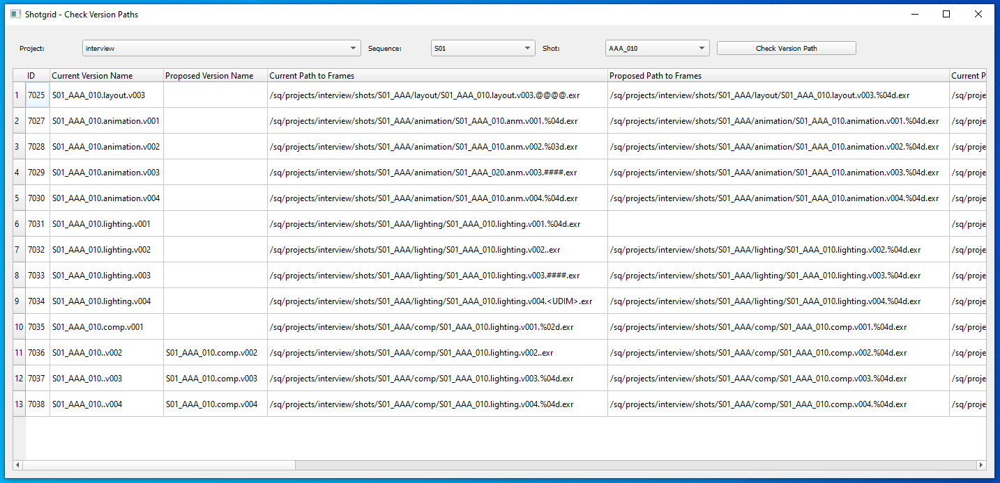

# Check Versions and Version Paths Tool
This is a graphical interface tool that access the Shotgrid database to verify if the version paths are following the pipeline standard.



### Usage
Just run the main.py file.  
You can select the Project, Sequence, Shot, available in the Shotgrid to check the related version.
Press ```Check Version Path``` button to have a list with the versions that do not follow the pattern: ```{sequence}_{shot}.{pipeline_step}.{version}```

For each version that is out of the pattern, a proposed value is presented to correct the issue.


#### TO DO: Pending changes
- Document the code according to the PEP8.
- Apply a better style that fits Shotgrid.
- Add a note on the bottom of the window, so the user will be able to see how many versions were checked as a total.
- Put each Class in its own file.
- Align the button to the left.
